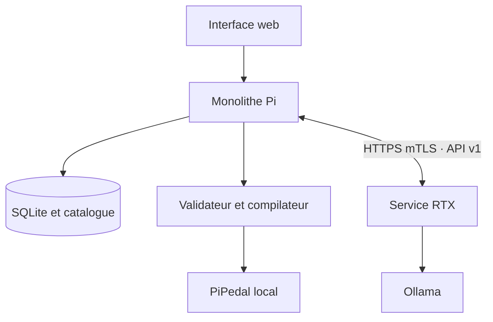

# Architecture

## Principe directeur

Le Raspberry Pi est l'orchestrateur et la racine de confiance. La RTX est un calculateur non autoritaire : sa réponse est une proposition, jamais une commande. Une disparition du PC ou du réseau ne touche pas au processus audio PiPedal ; seul le travail IA bascule vers une recette locale.

## Modules

| Module | Machine | Responsabilité |
|---|---|---|
| `catalog` | Pi | Exposer des identifiants opaques, vérifier plugin/port/plage/ressource/révision/hash |
| `db` | Pi | Catalogue immuable, profils, travaux, artefacts et migrations SQLite |
| `degraded` | Pi | Trois recettes déterministes basées exclusivement sur le catalogue actif |
| `compiler` | Pi | Résoudre et re-hacher les fichiers locaux, construire puis relire l'archive `.piPreset` |
| `pi.jobs` | Pi | Cycle de vie asynchrone, RTX → repli → validation → compilation → import optionnel |
| `pi.pipedal_client` | Pi | Upload local, activation WebSocket, vérification et rollback |
| `pi.system_guard` | Pi | Refuser un travail de fond si charge ou disque menacent l'audio |
| `rtx.ollama` | RTX | Prompt structuré et parsing strict du `ProposalSet` |
| `providers` | Pi | Point d'extension versionnable pour Tone3000 ; désactivé dans le MVP |

## Flux texte vers preset

1. Le Pi fige `catalog_revision` et `catalog_sha256` dans le travail.
2. Il envoie à la RTX la description, le profil et un `CatalogCapabilitySet` sans chemin.
3. Ollama retourne exactement trois `PresetSpec`.
4. Le Pi rejette tout catalogue périmé, identifiant inconnu, valeur hors plage ou plugin réservé au rendu.
5. Le compilateur résout chaque `asset_id`, vérifie taille et SHA-256, crée l'archive dans un fichier temporaire, la relit puis effectue un renommage atomique.
6. L'utilisateur télécharge ou importe explicitement. L'activation est une opération distincte et vérifiée.

## Invariants

- aucune donnée RTX n'est utilisée comme chemin ;
- aucun accès shell distant n'existe ;
- une proposition ne survit pas à un changement de catalogue ;
- seuls les fichiers inventoriés et inchangés peuvent être embarqués ;
- chaîne série uniquement, au plus la longueur configurée ;
- TooB File Player et TooB Record Input sont interdits dans un preset live ;
- les secrets restent dans l'environnement, jamais dans SQLite.
