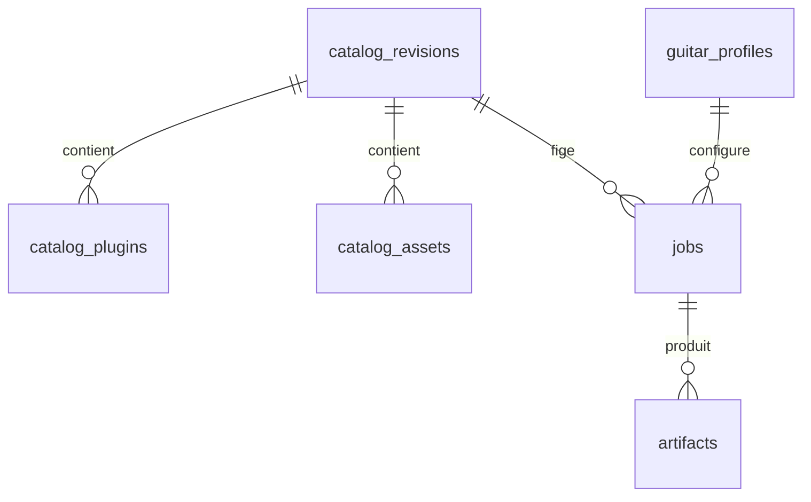

# Modèle SQLite et arborescence

## SQLite

Le schéma catalogue de phase zéro est conservé ; l'application migre les versions
1 à 4 vers `user_version=5` sans modifier les révisions ni les données existantes.



| Table | Clé | Contenu |
|---|---|---|
| `catalog_revisions` | `revision` | Hash du catalogue, versions, dates et compteurs |
| `catalog_plugins` | `(revision, plugin_id)` | URI et descripteur LV2 canonique |
| `plugin_ports` | `(revision, plugin_id, port_index)` | Types, plages et valeurs par défaut |
| `catalog_assets` | `(revision, asset_id)` | Type, chemin relatif privé au Pi, taille et SHA-256 |
| `catalog_state` | singleton | Révision active |
| `catalog_warnings` | `(revision, warning_index)` | Diagnostics d'inventaire |
| `guitar_profiles` | `profile_id` | Guitare, micro et calibration d'entrée |
| `jobs` | `job_id` | Requête, catalogue figé, état, source et proposition |
| `artifacts` | `artifact_id` | Variante, fichier, hash, import et activation |
| `asset_metadata` | `(revision,asset_id,source)` | Tone3000, métadonnées NAM/IR et profils mesurés avec contexte |
| `guitar_calibrations` | `profile_id` | Valeur NAM technique mesurée, distincte du trim musical |
| `di_sets` | `set_id` | Manifeste validé, hashes audio et emplacement privé |
| `bench_sessions` | `session_id` | Catalogue figé, travail/DI, état, rapport et erreur |
| `bench_candidates` | `candidate_id` | Spec exactement rendue, hashes, mesures, runtime et preview |
| `preferences` | `preference_id` | Retour explicite, profil guitare et hashes des assets |

Les secrets ne sont dans aucune table. Les chemins d'assets ne quittent jamais le Pi ; l'API de capacités fournit seulement `asset_id`, nom d'affichage, type, taille et hash.

## Dépôt

```text
pipedal-ai-mvp/
├── config/                 exemples Pi et RTX
├── deploy/systemd/         unités durcies
├── docs/                   architecture, installation et exploitation
├── schemas/api-v1/         contrats JSON actuels
├── src/pipedal_ai/
│   ├── pi/                 autorité, travaux, PiPedal et garde système
│   ├── rtx/                service Ollama non autoritaire
│   ├── web/                interface statique embarquée
│   ├── catalog.py          capacités et validation
│   ├── compiler.py         générateur .piPreset
│   ├── db.py               SQLite et migration
│   └── models.py           contrats Pydantic stricts
├── tests/                  tests du MVP et presets de référence
└── tools/phase0/           collecteur et publication du catalogue
```
